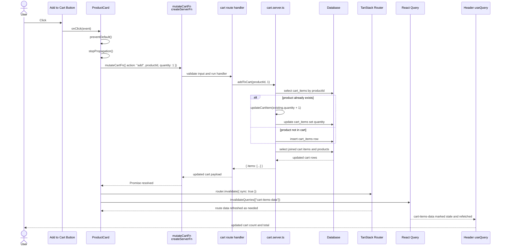

# What Happens When A User Clicks "Add to Cart" On A Product Card

This document explains the full flow that starts when a user clicks the Add to Cart button in the product card component and ends when the UI refreshes to reflect the updated cart state.

## Entry Point

The click starts in [src/components/ProductCard.tsx](src/components/ProductCard.tsx#L51).

That button lives inside a route link. The whole card is wrapped in a Link to the product details page in [src/components/ProductCard.tsx](src/components/ProductCard.tsx#L18). Because of that, a normal click inside the card would navigate to the product page.

The button overrides that default behavior in [src/components/ProductCard.tsx](src/components/ProductCard.tsx#L56-L57):

- e.preventDefault() stops the Link navigation
- e.stopPropagation() stops the click event from bubbling up to the parent Link

Without those two calls, clicking Add to Cart would also open the product details page.

## Client-Side Action

After stopping navigation, the button calls mutateCartFn in [src/components/ProductCard.tsx](src/components/ProductCard.tsx#L58-L64).

The payload sent is:

- action: add
- productId: product.id
- quantity: 1

That means every click requests one more unit of the current product.

## What mutateCartFn Really Is

mutateCartFn is imported from [src/routes/cart.tsx](src/routes/cart.tsx#L17).

It is defined using createServerFn, which means:

- the function can be called from client-side React code
- the actual handler runs on the server
- from the browser’s point of view, this behaves like a typed RPC call back to the server

So even though ProductCard is a client-side interactive component, the database update does not happen in the browser. It happens on the server.

## Input Validation

Before the server handler runs, the input passes through the validator in [src/routes/cart.tsx](src/routes/cart.tsx#L18-L19).

The input shape comes from [src/types/cart-types.ts](src/types/cart-types.ts#L3). For this button click, the valid branch is:

- action is add
- productId is required
- quantity is required

This gives the mutation a strongly typed contract.

## Server Mutation Dispatch

Inside the server handler in [src/routes/cart.tsx](src/routes/cart.tsx#L20-L32), the code imports four server-side cart functions from [src/data/cart.server.ts](src/data/cart.server.ts).

Then it switches on data.action.

For the product card button, the action is add, so this branch runs in [src/routes/cart.tsx](src/routes/cart.tsx#L24-L25):

- addToCart(data.productId, data.quantity)

So the next important step is the addToCart function.

## Server-Side Cart Update

The addToCart implementation is in [src/data/cart.server.ts](src/data/cart.server.ts#L53).

Here is what it does:

1. It clamps the requested quantity into a safe range in [src/data/cart.server.ts](src/data/cart.server.ts#L54).
2. It queries the cart_items table to see whether this product is already in the cart in [src/data/cart.server.ts](src/data/cart.server.ts#L57-L61).
3. If the product already exists, it increases the quantity by calling updateCartItem in [src/data/cart.server.ts](src/data/cart.server.ts#L64-L66).
4. If the product does not exist yet, it inserts a new row into the cart_items table in [src/data/cart.server.ts](src/data/cart.server.ts#L67-L70).
5. It returns the fresh cart state by calling getCartItems in [src/data/cart.server.ts](src/data/cart.server.ts#L72).

This means a repeated click on the same product does not create duplicate visual items. Instead, it increments quantity for the existing cart row.

## How Quantity Updates Work

If the product already exists, addToCart delegates to updateCartItem in [src/data/cart.server.ts](src/data/cart.server.ts#L42).

updateCartItem does the following:

1. It clamps the quantity between 0 and 99 in [src/data/cart.server.ts](src/data/cart.server.ts#L43).
2. If the final quantity is 0, it deletes the cart row in [src/data/cart.server.ts](src/data/cart.server.ts#L46-L48).
3. Otherwise it checks whether a cart row exists in [src/data/cart.server.ts](src/data/cart.server.ts#L50-L55).
4. If a row exists, it updates the quantity in [src/data/cart.server.ts](src/data/cart.server.ts#L58-L59).

For the Add to Cart button path, this usually means existing quantity + 1, capped at 99.

## How The Cart Response Is Built

After the mutation, the server returns the updated cart using getCartItems in [src/data/cart.server.ts](src/data/cart.server.ts#L17).

That function:

1. Joins cartItems with products in the database in [src/data/cart.server.ts](src/data/cart.server.ts#L18-L22)
2. Sorts items by createdAt descending in [src/data/cart.server.ts](src/data/cart.server.ts#L22)
3. Maps the joined database rows into a UI-friendly object in [src/data/cart.server.ts](src/data/cart.server.ts#L24-L29)

The result shape is:

- items: an array of product data
- each item also includes quantity

So the returned cart is already prepared for rendering.

## UI Refresh After The Mutation

Back in the product card component, once mutateCartFn resolves, two refresh steps happen.

### Route invalidation

The component calls router.invalidate in [src/components/ProductCard.tsx](src/components/ProductCard.tsx#L65).

This tells TanStack Router to invalidate route data and rerun relevant loaders. That matters because route loaders may be showing cart-related state elsewhere in the app.

For example, the cart route loader in [src/routes/cart.tsx](src/routes/cart.tsx#L35-L38) fetches cart items through fetchCartItems. If that route is revisited or currently active, invalidation ensures fresh loader data is used.

### React Query invalidation

The component also calls queryClient.invalidateQueries in [src/components/ProductCard.tsx](src/components/ProductCard.tsx#L66-L68) with the key cart-items-data.

This tells React Query that anything cached under that key should be considered stale and refetched when appropriate.

That is useful if another part of the UI, such as a header badge or cart summary, is reading cart data with React Query.

### Why this matters for the Header cart area

The Header is one of the main reasons the React Query invalidation is necessary. In [src/components/Header.tsx](src/components/Header.tsx#L14-L17), the Header uses `useQuery` with the `cart-items-data` key. That query calls a server function which returns the cart count and total from the database. The values displayed in the Header in [src/components/Header.tsx](src/components/Header.tsx#L58-L61) come from that cached query result.

The server-side count and total are calculated in [src/data/cart.server.ts](src/data/cart.server.ts#L5-L13). That means the Header is not deriving its numbers from the local product card state. It is reading a database-backed summary.

This has an important consequence:

- after `mutateCartFn` updates the database, the Header still holds the old React Query cache until that query is invalidated and refetched
- if `invalidateQueries({ queryKey: ["cart-items-data"] })` is removed, the cart count and total in the Header can stay stale even though the database is already correct

In practical terms, a user could click Add to Cart, the database row would update successfully, but the Header could still show the previous item count and total until a full reload or some other refetch happens.

### Why route invalidation still matters

React Query invalidation keeps the Header summary fresh, but it does not replace route invalidation.

`router.invalidate({ sync: true })` is still important because route loader data is managed by TanStack Router, not by React Query. In this app, the cart route loader in [src/routes/cart.tsx](src/routes/cart.tsx#L35-L38) fetches the full cart contents. If the current route or a related route is relying on loader data, router invalidation makes TanStack Router treat that data as stale and rerun loaders as needed.

This means the two invalidations solve different synchronization problems:

- React Query invalidation updates shared query-backed UI such as the Header cart badge and total
- route invalidation updates route-backed UI such as the cart page and any route data that should reflect the latest database state

If only React Query invalidation runs, the Header may update while route loader data can remain stale.

If only route invalidation runs, route data may refresh but the Header can still keep showing the old `cart-items-data` cache.

Using both keeps the two data systems aligned with the same database mutation.

## Why Both Invalidations Are Used

The codebase uses both TanStack Router and TanStack Query, and they solve different caching problems:

- TanStack Router manages route loader data
- TanStack Query manages query cache entries

Calling both invalidations is what keeps the cart UI coherent across the whole app after a mutation. The cart page depends on route-managed data, while the Header depends on the `cart-items-data` React Query cache. Both are reading from the same database, but through different client-side state systems.

That is why both actions happen immediately after the mutation resolves in [src/components/ProductCard.tsx](src/components/ProductCard.tsx#L69-L77):

- one refresh path updates route data
- the other refresh path updates query-cached summary data

Without both, different parts of the UI could disagree about what is actually in the cart.

## Important Navigation Detail

The Add to Cart button sits inside a Link wrapper in [src/components/ProductCard.tsx](src/components/ProductCard.tsx#L18-L22).

That means the card has two possible click behaviors:

- clicking the card body navigates to the product detail page
- clicking the button adds the product to the cart without navigating

That split only works because the button handler stops the link behavior first.

## End-To-End Flow Summary

1. User clicks Add to Cart in [src/components/ProductCard.tsx](src/components/ProductCard.tsx#L51)
2. The click handler prevents the parent Link from navigating in [src/components/ProductCard.tsx](src/components/ProductCard.tsx#L56-L57)
3. The component calls mutateCartFn with action add in [src/components/ProductCard.tsx](src/components/ProductCard.tsx#L58-L64)
4. mutateCartFn runs its server handler in [src/routes/cart.tsx](src/routes/cart.tsx#L20-L32)
5. The server dispatches to addToCart in [src/routes/cart.tsx](src/routes/cart.tsx#L24-L25)
6. addToCart inserts or updates the database row in [src/data/cart.server.ts](src/data/cart.server.ts#L53-L72)
7. The server returns the latest cart data via getCartItems in [src/data/cart.server.ts](src/data/cart.server.ts#L17-L30)
8. The client invalidates router data in [src/components/ProductCard.tsx](src/components/ProductCard.tsx#L65)
9. The client invalidates React Query cache in [src/components/ProductCard.tsx](src/components/ProductCard.tsx#L66-L68)
10. Cart-related UI can refresh with current data

## Design Notes

A few implementation details are worth noting:

- ProductCard imports a cart mutation directly from [src/routes/cart.tsx](src/routes/cart.tsx). This works, but it couples a reusable component to a route module.
- There is no explicit loading state on the button while the mutation is running.
- There is no explicit error handling in the button click path.
- The mutation always adds exactly one unit per click.
- Quantity is capped on the server, which is important because client input should never be trusted.

## Practical Result For The User

From the user’s point of view, clicking Add to Cart does this:

- stays on the current page
- sends a request to the server
- updates the cart in the database
- refreshes cart-related UI state

## Mermaid Sequence Diagram

This diagram shows the same flow as the sections above, but in request order. The key point is that the click begins in the client component, the cart mutation runs on the server through `createServerFn`, and then the client invalidates both router-managed and query-managed data so the UI can refresh. The Header is specifically tied to the React Query invalidation path because it renders the `cart-items-data` count and total rather than route loader data.
